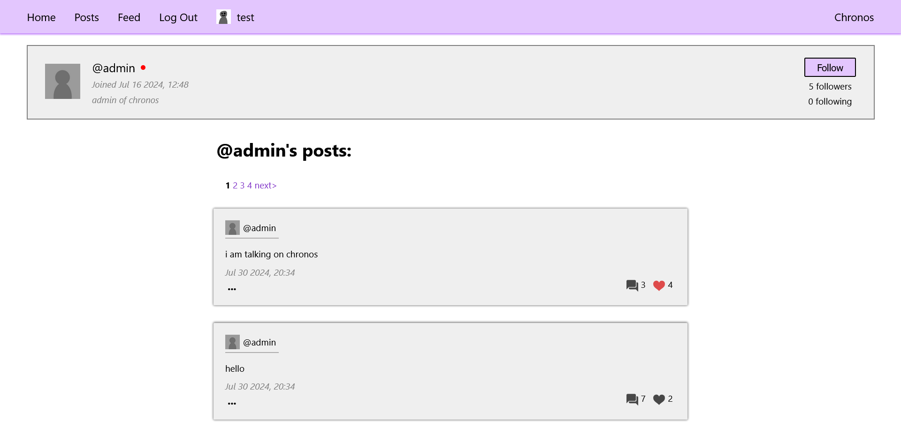

# Chronos
Chronos is a simple social media created using [Express.js](https://github.com/expressjs/express). It supports user creation, posts, commenting, and loves, among other features.

## Use
To self-host, you need to download the repository. Then, navigate to the directory that contains the `package.json` file and type `npm install`. Then, you must connect the backend to a SQL database. Create a MySQL database and copy-paste the code in the `schema.sql` file in order to set everything up. Next, create a file called `.env` in the `backend` folder and define environment variables called `MYSQL_PASSWORD`, `MYSQL_HOST` (e.g. localhost), `MYSQL_USER`, and `MYSQL_DB` (database name) that correspond to your MySQL database. Also define `PORT`, which is the port on which the website will be hosted. Make sure you have [node.js](https://nodejs.org/en) installed, and then run `node .` or `node index.js` in the backend directory. The website should now be available locally.

## Todo
- Pagination
- Add profile pictures
- Add following and feed
- Add user bios
- Add notifications
- Add proper home screen
- Add editing posts
- Add reposts
- More moderator actions (banning, etc.)
- Redesign parts of the website

## Bugs
- Adding too many newlines in the post creation box makes the text go outside the box

Please let me know if you find any bugs or security issues.